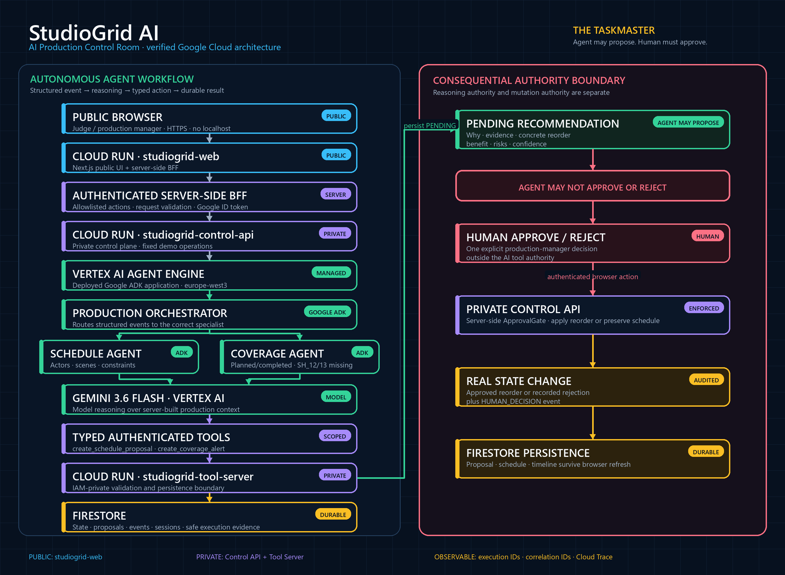

# StudioGrid AI

**AI Production Control Room** — a deployed multi-agent control plane for film-shoot disruptions.

> StudioGrid understands what was planned, what changed, what production work is now blocked, and what eligible work can move next. Agents may propose; a human must approve consequential schedule mutations.

[](LICENSE)
[](https://studiogrid-web-729921508335.europe-west3.run.app)
[]()
[]()

## Quick judge path

Hosted demo: **<https://studiogrid-web-729921508335.europe-west3.run.app>**

1. Click **Reset Demo**.
2. Select **Maya Reed** and simulate the fixed **45-minute delay**.
3. Wait for the real Vertex AI Agent Engine proposal.
4. Inspect WHY, evidence, risks, confidence, and Technical Evidence.
5. Click **Approve as human**.
6. Compare schedule **BEFORE / AFTER**.
7. Find the persisted `HUMAN_DECISION` in the timeline; refresh to confirm durability.
8. Run **Coverage Check** and inspect missing `SH_12` / `SH_13`.

The demo uses the fictional film **LAST LIGHT**, original synthetic production data, and no real customer information. No localhost or sign-in is required for the hosted judge path.

## What StudioGrid does

A film production day is a live constraint system. Actor availability, scene dependencies, location windows, daylight, completed work, and missing coverage interact. Traditional tools record a schedule; StudioGrid performs a bounded operational workflow when reality changes.

For an actor delay:

1. A structured `ACTOR_DELAYED` fact enters the private control plane.
2. A deployed Google ADK Production Orchestrator routes the event.
3. The Schedule Agent uses Gemini 3.6 Flash to evaluate current production constraints.
4. The agent invokes a typed private tool and creates a durable **PENDING** recommendation.
5. The AI cannot approve or reject its own proposal.
6. A human production manager decides.
7. Approval applies the reorder and persists a `HUMAN_DECISION`; rejection leaves the schedule unchanged.

The Coverage Agent independently compares planned and completed shots and creates an alert from actual state.

## FACT / INFERENCE / RECOMMENDATION / HUMAN_DECISION

| Category | Example |
|---|---|
| **FACT** | Maya Reed is reported delayed by 45 minutes |
| **INFERENCE** | Actor-dependent scenes are temporarily blocked |
| **RECOMMENDATION** | Reorder specific eligible scenes |
| **HUMAN_DECISION** | Production Manager approved or rejected the proposal |

The UI and data model keep these categories distinct so model conclusions are not presented as observed facts.

## Verified cloud architecture



```text
Public browser
  → public Cloud Run: studiogrid-web
  → server-side authenticated BFF
  → private Cloud Run: studiogrid-control-api
  → Vertex AI Agent Engine
  → Google ADK Production Orchestrator
      ├─ Schedule Agent
      └─ Coverage Agent
  → Gemini 3.6 Flash
  → authenticated typed tools
  → private Cloud Run: studiogrid-tool-server
  → Firestore

PENDING proposal → HUMAN APPROVE / REJECT → Control API → durable mutation/audit
```

| Google technology | Current use |
|---|---|
| **Gemini 3.6 Flash** | Vertex AI model reasoning over server-built production context |
| **Google ADK 2.6.3** | Production Orchestrator and Schedule/Coverage specialist graph |
| **Vertex AI Agent Engine** | Deployed remote ADK application in `europe-west3` |
| **Cloud Run** | Public Next.js web plus two IAM-private Python services |
| **Firestore** | Demo state, proposals, alerts, events, sessions, and safe execution evidence |
| **Cloud Trace** | Sampled cloud trace and execution correlation evidence |

Agent Engine resource:

```text
projects/729921508335/locations/europe-west3/reasoningEngines/5132986471388545024
```

## Agent responsibilities

| Agent | Responsibility |
|---|---|
| `PRODUCTION_ORCHESTRATOR` | Routes structured production events to a specialist |
| `SCHEDULE_AGENT` | Evaluates actor, scene, location, dependency, timing, and daylight constraints; creates PENDING schedule proposals |
| `COVERAGE_AGENT` | Compares planned/completed shots and creates coverage alerts |

Phase 1 deterministic agents for continuity, risk, and wrap reporting remain in the repository, but the public cloud golden path claims only the remotely verified Production Orchestrator, Schedule Agent, and Coverage Agent.

## Authority and security boundaries

- The browser reaches only the public web service.
- The Next.js BFF accepts allowlisted demo actions, caps request size, rate-limits actions, and obtains a server-side Google ID token for the private Control API.
- The Control API accepts fixed structured events; arbitrary prompt fields are forbidden.
- Agent Engine calls a separate private Tool Server with its runtime identity.
- Agents never access Firestore directly.
- Tool inputs and state transitions are validated with Pydantic schemas.
- Agent proposals must be PENDING and reference known scenes.
- `ApprovalGate` permits only HUMAN callers to approve/reject schedule proposals.
- ADC/service identities are used; service-account JSON keys are neither required nor committed.
- Safe evidence excludes credentials, raw prompts, and chain-of-thought.

See [SECURITY.md](SECURITY.md) and [architecture.mmd](docs/all-things-agentic/architecture.mmd).

## Repository layout

```text
agents/                         Google ADK and deterministic agent implementations
apps/web/                       Next.js public web/BFF
demo/last_light/                Synthetic LAST LIGHT production package
docs/adr/                       Architecture decisions
docs/evidence/                  Safe verified cloud evidence
docs/all-things-agentic/        Submission copy, diagram, video, and judging evidence
services/api/                   FastAPI Control API and Tool Server code
tests/                          Backend tests
```

## Reproducibility and spin-up

### Requirements

- Git
- Python **3.11+** (Cloud Run image uses Python 3.12)
- Node.js **22.12+** and npm (web image uses Node 22)
- Optional: Docker
- For real cloud mode: a Google Cloud project with billing, `gcloud`, ADC or workload identity, and permission to create/configure the resources described below

Clone the repository using the URL supplied in the Devpost entry, then run all commands from the repository root unless a step says otherwise.

### 1. Local deterministic API

This path requires no Google Cloud account and loads the synthetic LAST LIGHT package into the local state store.

```bash
python -m venv .venv
# Windows PowerShell: .\.venv\Scripts\Activate.ps1
# macOS/Linux: source .venv/bin/activate
python -m pip install --upgrade pip
python -m pip install -e "services/api[dev]"
python -m uvicorn services.api.main:app --reload --host 127.0.0.1 --port 8000
```

Check `http://127.0.0.1:8000/health`. With cloud flags left false, the API reports deterministic DEV mode.

### 2. Frontend development

```bash
cd apps/web
npm ci
npm run dev
```

Open `http://localhost:3000/en/dashboard`.

The cloud-demo dashboard route intentionally uses the authenticated server-side BFF. To make its action buttons operational, configure `CONTROL_API_URL` and `CONTROL_API_AUDIENCE` to the same HTTPS private Control API URL and run the Next.js server under a Google identity that already has `run.invoker` on that exact service. Do not expose these variables with a `NEXT_PUBLIC_` prefix and do not use service-account key files.

The easiest judge path is the hosted public URL above. External evaluators are not expected to receive IAM access to private services.

### 3. Environment variables

Copy `.env.example` only for local development:

```bash
cp .env.example .env.local
```

On Windows PowerShell use `Copy-Item .env.example .env.local`. Never commit `.env.local`.

Important real-runtime variables:

| Variable | Purpose |
|---|---|
| `GOOGLE_CLOUD_PROJECT` | Google Cloud project ID |
| `GOOGLE_CLOUD_LOCATION` | Vertex AI model location (`global` in the verified deployment) |
| `GOOGLE_CLOUD_AGENT_ENGINE_LOCATION` | Agent Engine region (`europe-west3`) |
| `GEMINI_MODEL` | `gemini-3.6-flash` |
| `STUDIOGRID_AGENT_ENGINE_RESOURCE` | Deployed reasoning engine resource name |
| `STUDIOGRID_TOOL_SERVER_URL` | Private Tool Server HTTPS URL |
| `STUDIOGRID_TOOL_SERVER_AUTHENTICATED` | Require authenticated private tool calls |
| `STUDIOGRID_FIRESTORE_ENABLED` | Enable durable Firestore state |
| `STUDIOGRID_CONTROL_API_ONLY` | Restrict an API deployment to `/control/*` |
| `STUDIOGRID_AGENT_TOOL_SERVER_ONLY` | Restrict an API deployment to `/tools/agent/*` |
| `CONTROL_API_URL` / `CONTROL_API_AUDIENCE` | Server-only web BFF target and ID-token audience |

### 4. Google Cloud prerequisites

Use a project you control. Enable at least:

```bash
gcloud services enable \
  aiplatform.googleapis.com \
  run.googleapis.com \
  cloudbuild.googleapis.com \
  artifactregistry.googleapis.com \
  firestore.googleapis.com \
  logging.googleapis.com \
  cloudtrace.googleapis.com
```

Create a Firestore Native database and a staging Cloud Storage bucket in the chosen regions. Create separate runtime service accounts for Agent Engine, the web BFF, the Control API, and the Tool Server. Grant only the required scoped permissions:

- Agent runtime: invoke the exact private Tool Server and use required Vertex/telemetry services.
- Web runtime: invoke the exact private Control API only.
- Control runtime: invoke the exact Agent Engine resource, access the demo Firestore namespace, and write logs/traces.
- Tool runtime: access the demo Firestore namespace and write logs/traces.

Do not grant `allUsers` to the Control API or Tool Server. The verified deployment exposes only `studiogrid-web` publicly.

### 5. Deploy in dependency order

1. **Tool Server:** build the root `Dockerfile`; deploy with `STUDIOGRID_AGENT_TOOL_SERVER_ONLY=true`, Firestore enabled, and unauthenticated access disabled.
2. **Agent Engine:** update the constants in `agents/google_adk/deploy_agent_engine.py` for your project, bucket, runtime service account, and private Tool Server URL. From the repository root, install `agents/google_adk/requirements.agent_engine.txt`, authenticate with ADC, then run:

   ```bash
   python -m agents.google_adk.deploy_agent_engine
   ```

   The helper refuses to create a duplicate matching engine unless the explicit reuse/update option is used.
3. **Control API:** deploy the root image with `STUDIOGRID_CONTROL_API_ONLY=true`, Firestore enabled, the Agent Engine resource set, and unauthenticated access disabled.
4. **Web:** build from `apps/web/Dockerfile`; set server-only `CONTROL_API_URL` and `CONTROL_API_AUDIENCE`; deploy publicly under the web runtime identity.
5. Verify IAM boundaries before running the demo: public web returns 200; unauthenticated Control/Tool requests return 401/403.

The committed deployment helper is pinned to the verified StudioGrid resource values so it cannot be treated as a generic one-command installer. Review its constants before using another project. Never copy credentials into source files.

### 6. Seed/reset and real-agent checks

- Local API startup loads `demo/last_light/production_package.json`.
- The public demo **Reset Demo** action resets only the synthetic `last-light-demo` application state for the current demo session and preserves audit/evidence collections.
- `python -m agents.google_adk.smoke_schedule` runs the local real-agent milestone and requires ADC plus configured Google Cloud resources.
- Set `RESOURCE_NAME` to a reasoning-engine resource you own, then run `python -m agents.google_adk.smoke_agent_engine --resource "$RESOURCE_NAME"`; inspect `--help` first.

### 7. Validation

```bash
python -m pytest -q

cd apps/web
npm test
npm run lint
npm run typecheck
npm run build
```

## Evidence

- [Agent Engine cloud evidence](docs/evidence/agent-engine-cloud-3b.json)
- [Cloud demo deployment evidence](docs/evidence/cloud-demo-3c/deployment.json)
- [Browser verification](docs/evidence/cloud-demo-3c/browser-verification.md)
- [All Things Agentic official requirements](docs/all-things-agentic/OFFICIAL_REQUIREMENTS.md)
- [Project chronology](docs/all-things-agentic/PROJECT_CHRONOLOGY.md)
- [Video/live capture sequence](docs/all-things-agentic/LIVE_CAPTURE_SEQUENCE.md)

## Development assistance disclosure

AI coding assistants are permitted by the All Things Agentic Official Rules. StudioGrid used Codex during later development/submission preparation and preserves its historical IBM Bob Phase 1 development log in [docs/IBM_BOB_DEVELOPMENT_LOG.md](docs/IBM_BOB_DEVELOPMENT_LOG.md). Generated Phase 1 date metadata was corrected transparently; Git history retains the original text. See the chronology document for the evidence classification.

## Demo film — LAST LIGHT

LAST LIGHT is a fully original synthetic production package:

- 4 fictional actors
- 3 fictional locations
- 10 scenes and 22+ planned shots
- synthetic schedule, continuity, coverage, and actor-delay scenarios
- no customer data, licensed script, or real film-studio information

Fictional 2025 dates inside the production package are story data, not project chronology.

## Current limitations

- The public flow is a controlled synthetic demo, not a deployment at a real film studio.
- Demo buttons trigger events; the current product does not claim continuous ingestion from real call sheets, calendars, email, or IoT systems.
- The verified remote agent graph covers Schedule and Coverage workflows; other deterministic Phase 1 agents are not claimed as deployed cloud agents.
- Agent Engine scales from zero, so a cold request can take longer than a warm request.
- The deploy helper contains verified project-specific constants and requires review for another Google Cloud project.
- No measured cost savings, production adoption, customer partnerships, or legal-compliance certification is claimed.

## All Things Agentic Hackathon

- Primary category: **The Taskmaster**
- Mandatory model: PASS — Gemini 3.6 Flash through Vertex AI
- Google Agent Framework: PASS — Google ADK
- Google Cloud infrastructure: PASS — Cloud Run and Firestore (plus Agent Engine/Trace)
- Submission materials: [docs/all-things-agentic](docs/all-things-agentic)

Personal eligibility, ownership representations, repository publication, video upload, and final Devpost submission remain explicit entrant actions.
